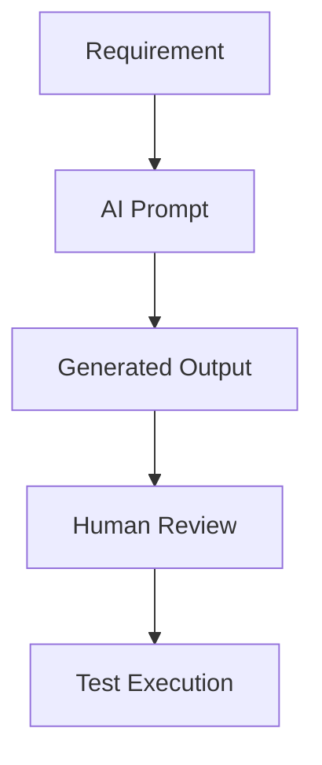

# AI Testing Best Practices

## Do's

* Provide detailed context.
* Define expected outputs.
* Use structured prompts.
* Validate AI-generated outputs.
* Review critical test cases manually.

## Don'ts

* Trust outputs blindly.
* Use sensitive production data.
* Skip human review.
* Ignore compliance requirements.

## Recommended Workflow

The most effective approach combines AI acceleration with human expertise.

