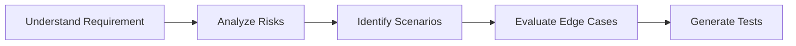
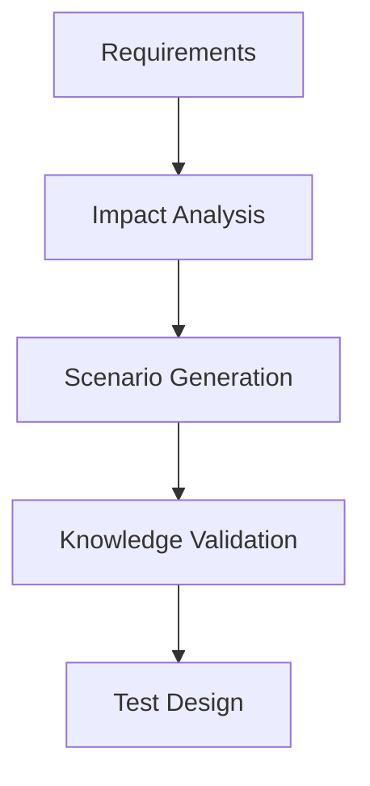

# Chain of Thought (CoT) Testing Framework

## Overview

Chain of Thought (CoT) Prompting is a prompt engineering technique that encourages AI models to reason through problems step-by-step before producing a final answer.

In Software Quality Engineering, CoT prompting can significantly improve:

* Test case generation
* Requirements analysis
* Defect investigation
* Root cause analysis
* Risk assessment
* Test data design
* API validation
* Quality reviews

Rather than asking AI to generate an immediate answer, CoT prompts guide the model through a structured reasoning process, resulting in more accurate, comprehensive, and explainable outputs.

---

# Why Chain of Thought Matters in Testing

Traditional prompts often produce generic or incomplete responses.

Example:

### Basic Prompt

```text
Generate test cases for a login page.
```

Typical Result:

* Valid Login
* Invalid Login
* Password Reset

While useful, these results often miss important edge cases and business risks.

---

### Chain of Thought Prompt

```text
Act as a Senior Test Architect.

Analyze the login feature step-by-step.

Step 1:
Identify business objectives.

Step 2:
Identify user personas.

Step 3:
Identify functional requirements.

Step 4:
Identify security requirements.

Step 5:
Identify boundary conditions.

Step 6:
Identify failure scenarios.

Step 7:
Generate comprehensive test cases.
```

Result:

* More detailed scenarios
* Better coverage
* Improved risk identification
* Stronger security testing

---

# Chain of Thought Testing Framework

## The 5-Step QE Reasoning Model



---

## Step 1: Understand Requirements

The AI should first understand:

* Business purpose
* User expectations
* Functional behavior
* Success criteria

### Example Prompt

```text
Analyze the following requirement.

Identify:

- Business objective
- User goals
- Functional expectations
- Success criteria

Requirement:

[Paste Requirement]
```

---

## Step 2: Analyze Risks

The AI should identify potential risks before generating test cases.

### Example Prompt

```text
Review the requirement.

Identify:

- Business Risks
- Technical Risks
- Security Risks
- Compliance Risks
- Operational Risks

Rank each risk as:

- Critical
- High
- Medium
- Low
```

---

## Step 3: Identify Test Scenarios

The AI expands the solution space by exploring different usage paths.

### Example Prompt

```text
Generate testing scenarios.

Consider:

- Positive Flows
- Negative Flows
- Alternate Flows
- Exception Handling
- Security Threats
- Usability Considerations
```

---

## Step 4: Evaluate Edge Cases

This step uncovers hidden defects.

### Example Prompt

```text
Identify edge cases.

Consider:

- Boundary Values
- Invalid Inputs
- Missing Data
- Large Volumes
- Concurrent Activity
- Network Failures
```

---

## Step 5: Generate Test Cases

The final step produces structured testing artifacts.

### Example Prompt

```text
Generate detailed test cases.

Include:

- Test Case ID
- Objective
- Preconditions
- Steps
- Expected Results
- Priority
```

---

# Applying CoT to Different Testing Activities

## Requirements Analysis

### Prompt

```text
Act as a Senior Business Analyst.

Review the requirement using Chain of Thought reasoning.

Step 1:
Summarize requirement.

Step 2:
Identify ambiguities.

Step 3:
Identify missing requirements.

Step 4:
Identify risks.

Step 5:
Recommend improvements.
```

### Benefits

* Better requirement quality
* Reduced rework
* Improved testability

---

## Defect Analysis

### Prompt

```text
Act as a Senior QA Engineer.

Analyze the defect step-by-step.

Step 1:
Understand failure.

Step 2:
Review affected functionality.

Step 3:
Identify possible causes.

Step 4:
Evaluate evidence.

Step 5:
Recommend next actions.
```

### Benefits

* Faster triage
* Improved root cause identification
* Better defect categorization

---

## Root Cause Analysis

### Prompt

```text
Perform a structured root cause analysis.

Step 1:
Describe incident.

Step 2:
List contributing factors.

Step 3:
Identify process gaps.

Step 4:
Identify technical causes.

Step 5:
Recommend preventive actions.
```

### Benefits

* More effective problem resolution
* Better process improvement initiatives

---

## Test Data Generation

### Prompt

```text
Generate test data using structured reasoning.

Step 1:
Understand business process.

Step 2:
Identify data entities.

Step 3:
Identify positive scenarios.

Step 4:
Identify negative scenarios.

Step 5:
Generate representative test data.
```

### Benefits

* Better coverage
* More realistic datasets
* Improved scenario representation

---

# Advanced CoT Framework for Enterprise Testing

## RISK Model

A reusable framework for Quality Engineering prompts.

### R – Requirements

Understand business requirements.

### I – Impact

Evaluate business impact.

### S – Scenarios

Generate testing scenarios.

### K – Knowledge Validation

Validate assumptions and outputs.



---

# Example: Payments Authorization Testing

## Standard Prompt

```text
Generate payment authorization test cases.
```

Expected Output:

* Approved Transaction
* Declined Transaction

---

## CoT Prompt

```text
Act as a Payments Testing Specialist.

Step 1:
Understand payment authorization flow.

Step 2:
Identify participating systems.

Step 3:
Identify business rules.

Step 4:
Identify fraud risks.

Step 5:
Identify edge cases.

Step 6:
Generate comprehensive test scenarios.
```

Expected Output:

* Approved Transactions
* Expired Cards
* Invalid CVV
* Duplicate Requests
* Network Failures
* Fraud Detection
* Currency Validation
* Velocity Checks
* Timeout Handling
* Partial Authorization

This produces significantly richer test coverage.

---

# Best Practices

## Do

* Break complex tasks into logical steps.
* Ask the AI to explain reasoning.
* Validate outputs with subject matter experts.
* Use CoT for high-risk scenarios.
* Combine CoT with domain expertise.

## Avoid

* Overly broad prompts.
* Missing business context.
* Blind trust in AI-generated outputs.
* Using CoT when simple prompts are sufficient.

---

# Key Takeaways

* Chain of Thought prompting improves AI reasoning quality.
* Structured prompts generate better testing outcomes.
* CoT is especially valuable for complex business domains such as payments, banking, healthcare, and telecommunications.
* Quality Engineering teams can use CoT to improve test design, defect analysis, root cause analysis, and test data generation.
* Combining domain expertise with structured AI reasoning delivers the best results.

As AI becomes an integral part of Software Quality Engineering, Chain of Thought prompting will become a foundational skill for modern testers, automation engineers, and test architects.

